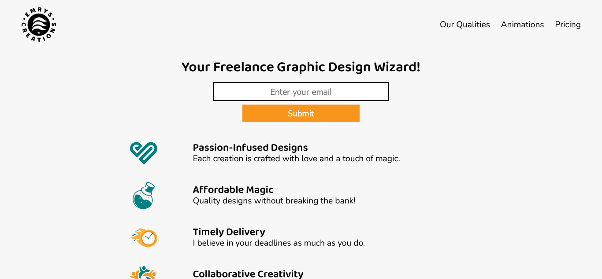

# freeCodeCamp - Certification Project - Product Landing Page

This is a solution to the [Certification Project - Product Landing Page](https://www.freecodecamp.org/learn/2022/responsive-web-design/build-a-product-landing-page-project/build-a-product-landing-page).

## Table of contents

- [Overview](#overview)
  - [Screenshot](#screenshot)
  - [Links](#links)
- [My process](#my-process)
  - [Built with](#built-with)
- [Author](#author)

### Overview

### Screenshot

### Links

- Live Site URL: [Emrys Creations - Product Landing Page](https://your-live-site-url.com)

## My process

### Built with

- Semantic HTML5 markup
- CSS custom properties
- A little JavaScript

## Author

- Website - [Gabe Phiri](https://www.facebook.com/Official.EmrysCreations")
